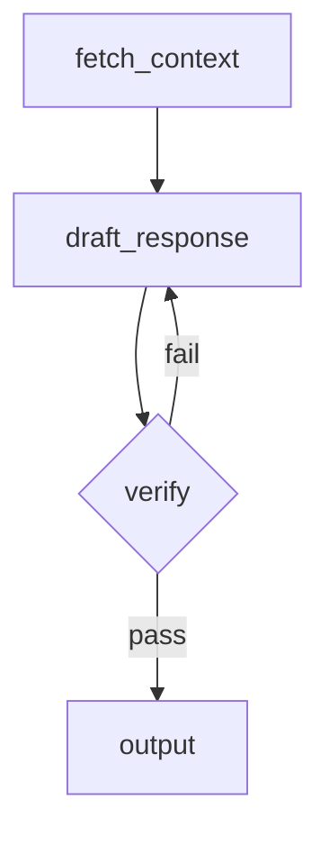

# agentme-edr-policy-018: AI agent development standards

## Context and Problem Statement

AI agent projects vary widely in how they choose frameworks, manage context, evaluate outputs, and structure workflows. Without a shared baseline, projects accumulate incompatible patterns for LLM provider abstraction, flow design, and dataset-driven testing.

Which tools, frameworks, and design patterns should AI agent projects follow to ensure reproducibility, testability, and maintainability?

## Decision Outcome

**Use Python with LangGraph for flow orchestration and MLflow for experiment tracking and local evaluation.**

This policy covers the **Agent** and **Workflow** tiers of the three-tier conceptual model defined in [agentme-edr-024](024-llm-development-standards.md). For the definition of LLM, Agent, and Workflow, and for the LangChain framework rules that govern direct LLM calls, see [agentme-edr-024](024-llm-development-standards.md).

### Details

#### 01-language-and-framework

All agent and workflow projects MUST be implemented in Python, following [agentme-edr-014](014-python-project-tooling.md) for project structure, tooling, and Makefile conventions.

Agent flows MUST be built with **LangGraph**. Use LangGraph `StateGraph` to model each distinct workflow as an explicit directed graph with typed state.

For all direct LLM calls within agent and workflow nodes, use LangChain per [agentme-edr-024](024-llm-development-standards.md).

#### 03-observability-and-experiment-tracking

Use **MLflow** for all agent and workflow observability and evaluation:

- Wrap each agent or workflow run with `mlflow.start_run()` to capture traces, parameters, and metrics locally.
- Log run parameters (model name, temperature, prompt version) and output metrics (accuracy, latency, token counts) using `mlflow.log_param` / `mlflow.log_metric`.
- Run a local MLflow tracking server with `mlflow ui` to inspect runs during development. Do not require a remote MLflow server for local development.
- For LangChain-level auto-tracing of individual LLM calls, see [agentme-edr-024](024-llm-development-standards.md) rule `03-llm-observability`.

#### 04-dataset-driven-accuracy-measurement

Every agent pipeline MUST have a companion evaluation dataset and an MLflow experiment that measures accuracy against it. Datasets and evals are organized per-workflow following rule `07-workflow-structure` and rule `08-workflow-evals`.

- **Evals** measure model accuracy and performance against expected outputs. They are REQUIRED before every release to verify the workflow meets specified accuracy thresholds. They run against real LLM providers to capture model drift. They log metrics to MLflow and MUST have project-defined quality thresholds that block releases when not met.
- **Integration tests** verify that workflows execute end-to-end with real connectors and real models, using pass/fail assertions. They are ADVISED but not required. They validate wiring, error handling, and system integration, not model accuracy. See rule `13-three-tier-testing-strategy` for integration test guidelines.

**Eval requirements:**

- Store evaluation datasets under `evals/<workflow>/` (sibling of `lib/` and `examples/`), following [agentme-edr-019](019-ml-dataset-structure.md) for structure and format. For MLflow input/output pairs, use the JSONL format described in `agentme-edr-019.04-complex-structured-datasets-must-use-jsonl`.
- Write evaluation scripts under `evals/<workflow>/` that load the dataset, run each input through the live agent (against real LLMs, not mocks), compare outputs to expected values, and log per-sample and aggregate metrics to an MLflow experiment.
- Add a `make eval` Makefile target in the module root Makefile (the same Makefile that sits alongside `lib/` and `examples/`) that delegates to all per-workflow eval targets.
- Evaluation MUST run against real LLM providers, not recorded responses, to capture model drift. MLflow tracking MUST work locally without a remote server.
- Evals MUST be executed before every release. Failed eval runs with accuracy below project-defined thresholds MUST block the release.

#### 05-flow-documentation

Each agent flow MUST be documented as a **Mermaid graph** in the project `README.md`. The diagram must match the LangGraph `StateGraph` definition:

- Use `graph TD` or `graph LR` direction.
- Label each node with its Python function name.
- Label conditional edges with the condition expression.
- Update the diagram whenever the graph topology changes.

Example minimal diagram block:



#### 06-verification-steps

Agent flows MUST include at least one explicit verification node before producing final output:

- Model the verification step as a dedicated LangGraph node (e.g. `verify_output`).
- The node checks the draft output against defined acceptance criteria (schema validation, factual consistency check, rubric scoring, or LLM-as-judge call).
- On failure, the verification node MUST route back to the relevant generation node, not silently pass through.
- Log verification results (pass/fail, score, reason) as MLflow metrics on the current run.

#### 07-workflow-structure

Agent logic MUST be organized as named workflows following [agentme-edr-021](021-pragmatic-hexagonal-architecture.md). Each workflow is an independent LangGraph `StateGraph` with a defined start node and end node, connecting agents, states, routes, and decision nodes.

Workflows live inside `app/workflows/` (the application layer), while external integrations such as LLM providers, vector stores, and third-party APIs live under `adapters/connectors/` (the outbound adapter layer). Inbound interfaces (HTTP API, CLI) live under `adapters/` as inbound adapters.

For each workflow named `<workflow>`, the full project layout is:

```text
lib/src/<package_name>/
  adapters/
    http/                      # inbound: API server that triggers workflows
    cli/                       # inbound: CLI entry point (if applicable)
    connectors/                # outbound: external resource integrations
      openai/                  # LLM provider connector
      azure-openai/            # alternative LLM provider connector
      postgres/                # database connector (if applicable)
      vector-store/            # vector DB connector (if applicable)
  app/
    workflows/
      <workflow>/
        graph.py               # StateGraph definition; entry point for the workflow
        agents.py              # LangChain agent definitions used by this workflow
        states.py              # Typed state dataclasses / TypedDicts
        routes.py              # Conditional edge functions
  shared/                      # infrastructure-agnostic utilities
```

- `app/workflows/<workflow>/graph.py` MUST define and compile the `StateGraph` and expose a `graph` object that callers invoke.
- Tool calls within workflow nodes that interact with external systems MUST use connectors from `adapters/connectors/`, not inline API calls.
- Additional modules (prompts, schemas) MAY be added inside `app/workflows/<workflow>/` when they are specific to that workflow. Shared utilities belong in `shared/`.
- Each workflow MUST be documented with a Mermaid diagram in the project `README.md` following rule `05-flow-documentation`.

#### 08-workflow-evals

For each workflow `<workflow>` there MUST be a corresponding eval directory:

```text
evals/
  <workflow>/
    Makefile                   # eval targets for this workflow
    dataset_<slice>/           # one folder per eval slice (see agentme-edr-019)
    eval_<slice>.py            # evaluation script for each slice
```

The `evals/<workflow>/Makefile` MUST define:

| Target | Behaviour |
|---|---|
| `eval` | Runs all eval slices for the workflow |
| `eval-<slice>` | Runs one named slice (e.g. `eval-simple`, `eval-complex`) |

Each `eval_<slice>.py` script MUST:

- Load the dataset from `evals/<workflow>/dataset_<slice>/` following [agentme-edr-019](019-ml-dataset-structure.md).
- Run every input through the live workflow against real LLMs.
- Log per-sample and aggregate metrics to an MLflow experiment that runs locally.

The module root Makefile `make eval` target MUST delegate to `eval` in every `evals/<workflow>/Makefile`.

#### 09-node-naming-conventions

LangGraph node names MUST follow a suffix convention that communicates the node's role at a glance. Names MUST be action-oriented and descriptive.

| Suffix | Node type | When to use |
|---|---|---|
| `_llm` | LLM call | Any node whose primary action is a direct LLM inference call |
| `_step` | Algorithmic step | Deterministic logic with no LLM involvement (transformation, validation, routing) |
| `_tool` | Tool/API call | A node that wraps a single external tool or API (e.g. a REST endpoint, DB query) |
| `_agent` | Subgraph agent | A node that invokes a nested subgraph containing its own tool-invocation cycle and LLM calls; prefer the **deepagents** library for these nodes |

The Python function implementing the node SHOULD share the same name as the node alias passed to `add_node`, so that graph definitions and stack traces remain unambiguous:

```python
def draft_doc_llm(state): ...
graph.add_node("draft_doc_llm", draft_doc_llm)

# Tool node — calls the Stripe API
def stripe_api_tool(state): ...
graph.add_node("stripe_api_tool", stripe_api_tool)
```

Names MUST NOT use generic labels such as `node1`, `process`, or `run`. Each name must clearly express what action the node performs.

#### 10-local-sandbox

When a workflow node or tool requires a **local sandbox** — an isolated environment where the agent can read files, glob-search directories, and execute shell commands — use the **[deepagents](https://github.com/deepagents/deepagents) framework** to provide that sandbox.

**When to apply this rule**

Use deepagents whenever ANY of the following is true for a workflow or tool:
- The agent needs to execute shell commands or scripts in a controlled environment.
- The agent needs to list, read, or search files across multiple directories at runtime.
- The agent operates on user-supplied or generated file trees that must not escape a sandboxed boundary.

**Integration requirements**

- Initialize the sandbox at the start of the workflow run and shut it down in the same `try/finally` block.
- Pass the sandbox handle into the LangGraph workflow state so all nodes share the same sandbox instance.
- If the host-side code needs to pass files into the sandbox (e.g. generated config or input data), create a temporary directory with `tempfile.mkdtemp()`, write the files there, and mount it into the sandbox. Clean it up in the `finally` block.
- Replace hand-rolled `read_file`, `search_files`, and `grep_file` tool implementations with the equivalent tools provided by deepagents.

#### 11-state-type-conventions

All TypedDict and dataclass types that represent LangGraph node or workflow state MUST end with `_state` in their name. This suffix signals at a glance that the type is a state boundary, not a plain data model.

**Naming reference:**

| Owner | Naming pattern | Example |
|---|---|---|
| Single agent / agent subgraph | `<agent_name>_agent_state` | `reviewer_agent_state` |
| Full workflow (`StateGraph`) | `<workflow_name>_workflow_state` | `document_workflow_state` |
| Named group of nodes sharing state | `<group_responsibility>_state` | `retrieval_pipeline_state` |

**Boundary rules:**

- Each agent or agent subgraph MUST define its own dedicated state type. Do not reuse or extend a generic state across unrelated agents.
- Each workflow (`StateGraph`) MUST define its own top-level state type. The workflow state is the authoritative boundary for that graph's inputs and outputs.
- When a group of nodes (not a full workflow and not a single agent) shares a state type, the type name MUST clearly reflect the shared responsibility. Generic names such as `shared_state`, `common_state`, or `global_state` are FORBIDDEN.
- Large workflows MUST NOT use a single monolithic state that all nodes read and write. Split the state into per-phase or per-agent state types scoped to the subgraph or set of nodes that produce or consume each field.

State type names SHOULD align with the agent or node names defined in rule `09-node-naming-conventions` (e.g., an agent node named `draft_doc_agent` has a state type named `draft_doc_agent_state`).

#### 12-workflow-naming-conventions

LangGraph `StateGraph` instances and their enclosing classes MUST be given a meaningful name that conveys the workflow's input, output, and/or behavior. The name MUST end with `Workflow` (PascalCase class) or `_workflow` (snake_case variable or directory).

Choose a name that summarises what the workflow consumes, processes, and produces — avoid generic labels such as `Pipeline`, `Flow`, `Graph`, or `Process`.

| Context | Pattern | Example |
|---|---|---|
| Python class | `<DescriptiveName>Workflow` | `FileMapJudgeReduceWorkflow` |
| Python variable / instance | `<descriptive_name>_workflow` | `file_map_judge_reduce_workflow` |
| Directory under `app/workflows/` | `<descriptive_name>_workflow` | `financial_report_analysis_workflow/` |

**Good names** communicate purpose at a glance:

- `FileMapJudgeReduceWorkflow` — maps files, judges each, then reduces results
- `FinancialReportAnalysisWorkflow` — analyses financial report inputs
- `MarketingCampaignExecutorWorkflow` — executes a marketing campaign end-to-end

**Bad names** (FORBIDDEN): `MainWorkflow`, `AgentGraph`, `ProcessFlow`, `Workflow1`, `RunGraph`.

#### 13-three-tier-testing-strategy

AI agent and workflow projects recognize three distinct testing tiers, each with its own purpose, tooling, and execution model:

| Tier | Purpose | Model source | External APIs | File naming | When to run | Required |
|---|---|---|---|---|---|---|
| **Unit tests** | Test workflow logic, routing, and state management in isolation | Mocked (FakeListChatModel) | Mocked or faked | `<name>_test.py` | On every commit | **Required** |
| **Integration tests** | Verify end-to-end wiring with real models and real external connectors | Real LLM providers | Real connectors | `<name>_integration_test.py` | Before releases or on a schedule | Advised |
| **Evals** | Measure model accuracy and performance against expected outputs | Real LLM providers | Real connectors | `eval_<slice>.py` (see rule 08) | Before every release | **Required** |

**Unit test requirements (REQUIRED):**

- MUST use mocked LLM providers (see [agentme-edr-024](024-llm-development-standards.md) rule `04-unit-test-mocking`).
- MUST run offline with no external dependencies per [agentme-edr-004](../principles/004-unit-test-requirements.md) rule `02-must-run-offline`.
- MUST achieve 80% code coverage per [agentme-edr-004](../principles/004-unit-test-requirements.md) rule `03-must-maintain-80-percent-coverage`.
- MUST test workflow routing logic, conditional edges, state transformations, and error handling.
- Files MUST be named `<name>_test.py` and placed alongside the source file per [agentme-edr-004](../principles/004-unit-test-requirements.md) rule `04-must-place-test-files-alongside-source`.
- MUST achieve 80% coverage of workflow graph edges and branches per rule `14-workflow-graph-coverage`.

**Integration test guidelines (ADVISED):**

Integration tests are advised but not required. See [agentme-edr-007](../principles/007-project-quality-standards.md) rule `08-integration-tests-are-advised` for general integration testing guidelines.

For AI agent and workflow projects specifically, when integration tests are implemented:

- SHOULD use real LLM providers configured via environment variables
- MAY use smaller, faster models (e.g., `gpt-3.5-turbo`) instead of production models to reduce cost and latency
- SHOULD verify workflow execution with pass/fail assertions, not accuracy metrics (accuracy is measured by evals)

**Eval requirements (REQUIRED):**

Evals are REQUIRED for all agent and workflow projects. See rule `04-dataset-driven-accuracy-measurement` and rule `08-workflow-evals` for full requirements.

- Evals MUST run against real LLM providers to capture model drift and log metrics to MLflow for tracking model performance over time.
- Evals MUST be executed before every release to verify the workflow meets specified accuracy thresholds.
- Failed eval runs with accuracy below project-defined thresholds MUST block the release.

#### 13-workflow-graph-coverage

LangGraph Workflows MUST achieve **80% coverage of workflow graph edges and branches** during unit-tests.

**Graph edge coverage** measures whether each transition (edge) in the `StateGraph` is exercised by at least one test. This ensures that routing logic, conditional edges, and error paths are tested.

**Requirements:**

- Every conditional edge (e.g., `add_conditional_edges`) MUST have test cases covering each possible branch.
- Every node→node transition MUST be exercised by at least one test.
- Error handling paths (e.g., nodes that route to error states or retry nodes) MUST be tested with inputs that trigger those paths.
- Use mocked LLM responses in unit tests to control which branches are taken (see [agentme-edr-024](024-llm-development-standards.md) rule `04-unit-test-mocking`).

**Example:**

```python
def test_workflow_approval_path():
    """Test the workflow takes the approval path when LLM returns APPROVE."""
    fake_llm = FakeListChatModel(responses=["APPROVE"])
    workflow = DocumentWorkflow(llm=fake_llm)
    
    result = workflow.invoke({"document": sample_doc})
    
    assert result["status"] == "approved"
    assert "verify_approved" in result["_visited_nodes"]

def test_workflow_rejection_path():
    """Test the workflow takes the rejection path when LLM returns REJECT."""
    fake_llm = FakeListChatModel(responses=["REJECT"])
    workflow = DocumentWorkflow(llm=fake_llm)
    
    result = workflow.invoke({"document": sample_doc})
    
    assert result["status"] == "rejected"
    assert "handle_rejection" in result["_visited_nodes"]
```

When measuring coverage, use the same 80% threshold: at least 80% of graph edges must be covered by unit tests.

## References

- [agentme-edr-024](024-llm-development-standards.md) — LLM development standards: LangChain framework, provider compatibility, LLM observability, unit test mocking, and the LLM / Agent / Workflow conceptual model
- [agentme-edr-004](../principles/004-unit-test-requirements.md) — Unit test requirements including coverage, offline execution, and test file placement
- [agentme-edr-021](021-pragmatic-hexagonal-architecture.md) — Adapter/application layer separation that defines the project layout
- [agentme-edr-014](014-python-project-tooling.md) — Python project tooling and structure
- [agentme-edr-019](019-ml-dataset-structure.md) — ML dataset structure for eval datasets
