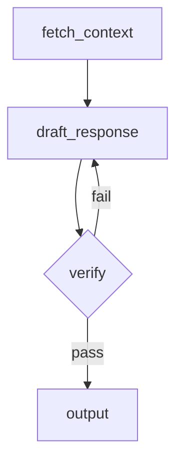

# agentme-edr-policy-018: AI agent development standards

## Context and Problem Statement

AI agent projects vary widely in how they choose frameworks, manage context, evaluate outputs, and structure workflows. Without a shared baseline, projects accumulate incompatible patterns for LLM provider abstraction, flow design, and dataset-driven testing.

Which tools, frameworks, and design patterns should AI agent projects follow to ensure reproducibility, testability, and maintainability?

## Decision Outcome

**Use Python with LangGraph for flow orchestration and MLflow for experiment tracking and local evaluation.**

### Details

#### 01-language-and-framework

All agent projects MUST be implemented in Python, following [agentme-edr-014](014-python-project-tooling.md) for project structure, tooling, and Makefile conventions.

Agent flows MUST be built with **LangGraph**. Use LangGraph `StateGraph` to model each distinct workflow as an explicit directed graph with typed state.

#### 02-llm-provider-compatibility

Agent code MUST be compatible with both **OpenAI** and **Azure OpenAI** providers without code changes. Achieve this by:

- Using the `langchain-openai` package which supports both providers through environment variables.
- Selecting the provider by setting `OPENAI_API_TYPE=azure` (Azure OpenAI) or omitting it (OpenAI).
- Never hardcoding provider-specific URLs, deployment names, or API versions in code; inject them through environment variables or a configuration object.

Minimum required environment variable surface:

| Variable | Purpose |
|---|---|
| `OPENAI_API_KEY` | API key (both providers) |
| `OPENAI_API_BASE` / `AZURE_OPENAI_ENDPOINT` | Endpoint (Azure only) |
| `OPENAI_API_VERSION` | API version (Azure only) |
| `AZURE_OPENAI_DEPLOYMENT` | Deployment/model name (Azure only) |
| `OPENAI_MODEL` | Model name (OpenAI only) |

#### 03-observability-and-experiment-tracking

Use **MLflow** for all agent observability and evaluation:

- Wrap each agent run with `mlflow.start_run()` to capture traces, parameters, and metrics locally.
- Enable LangChain auto-tracing via `mlflow.langchain.autolog()` at entry point startup.
- Log run parameters (model name, temperature, prompt version) and output metrics (accuracy, latency, token counts) using `mlflow.log_param` / `mlflow.log_metric`.
- Run a local MLflow tracking server with `mlflow ui` to inspect runs during development. Do not require a remote MLflow server for local development.

#### 04-dataset-driven-accuracy-measurement

Every agent pipeline MUST have a companion evaluation dataset and an MLflow experiment that measures accuracy against it. Datasets and evals are organized per-workflow following rule `07-workflow-structure` and rule `08-workflow-evals`.

- Store evaluation datasets under `evals/<workflow>/` (sibling of `lib/` and `examples/`), following [agentme-edr-019](019-ml-dataset-structure.md) for structure and format. For MLflow input/output pairs, use the JSONL format described in `agentme-edr-019.04-complex-structured-datasets-must-use-jsonl`.
- Write evaluation scripts under `evals/<workflow>/` that load the dataset, run each input through the live agent (against real LLMs, not mocks), compare outputs to expected values, and log per-sample and aggregate metrics to an MLflow experiment.
- Add a `make eval` Makefile target in the module root Makefile (the same Makefile that sits alongside `lib/` and `examples/`) that delegates to all per-workflow eval targets.
- Evaluation MUST run against real LLM providers, not recorded responses, to capture model drift. MLflow tracking MUST work locally without a remote server.

#### 05-flow-documentation

Each agent flow MUST be documented as a **Mermaid graph** in the project `README.md`. The diagram must match the LangGraph `StateGraph` definition:

- Use `graph TD` or `graph LR` direction.
- Label each node with its Python function name.
- Label conditional edges with the condition expression.
- Update the diagram whenever the graph topology changes.

Example minimal diagram block:



#### 06-verification-steps

Agent flows MUST include at least one explicit verification node before producing final output:

- Model the verification step as a dedicated LangGraph node (e.g. `verify_output`).
- The node checks the draft output against defined acceptance criteria (schema validation, factual consistency check, rubric scoring, or LLM-as-judge call).
- On failure, the verification node MUST route back to the relevant generation node, not silently pass through.
- Log verification results (pass/fail, score, reason) as MLflow metrics on the current run.

#### 07-workflow-structure

Agent logic MUST be organized as named workflows following [agentme-edr-021](021-pragmatic-hexagonal-architecture.md). Each workflow is an independent LangGraph `StateGraph` with a defined start node and end node, connecting agents, states, routes, and decision nodes.

Workflows live inside `app/workflows/` (the application layer), while external integrations such as LLM providers, vector stores, and third-party APIs live under `adapters/connectors/` (the outbound adapter layer). Inbound interfaces (HTTP API, CLI) live under `adapters/` as inbound adapters.

For each workflow named `<workflow>`, the full project layout is:

```text
lib/src/<package_name>/
  adapters/
    http/                      # inbound: API server that triggers workflows
    cli/                       # inbound: CLI entry point (if applicable)
    connectors/                # outbound: external resource integrations
      openai/                  # LLM provider connector
      azure-openai/            # alternative LLM provider connector
      postgres/                # database connector (if applicable)
      vector-store/            # vector DB connector (if applicable)
  app/
    workflows/
      <workflow>/
        graph.py               # StateGraph definition; entry point for the workflow
        agents.py              # LangChain agent definitions used by this workflow
        states.py              # Typed state dataclasses / TypedDicts
        routes.py              # Conditional edge functions
  shared/                      # infrastructure-agnostic utilities
```

- `app/workflows/<workflow>/graph.py` MUST define and compile the `StateGraph` and expose a `graph` object that callers invoke.
- Tool calls within workflow nodes that interact with external systems MUST use connectors from `adapters/connectors/`, not inline API calls.
- Additional modules (prompts, schemas) MAY be added inside `app/workflows/<workflow>/` when they are specific to that workflow. Shared utilities belong in `shared/`.
- Each workflow MUST be documented with a Mermaid diagram in the project `README.md` following rule `05-flow-documentation`.

#### 08-workflow-evals

For each workflow `<workflow>` there MUST be a corresponding eval directory:

```text
evals/
  <workflow>/
    Makefile                   # eval targets for this workflow
    dataset_<slice>/           # one folder per eval slice (see agentme-edr-019)
    eval_<slice>.py            # evaluation script for each slice
```

The `evals/<workflow>/Makefile` MUST define:

| Target | Behaviour |
|---|---|
| `eval` | Runs all eval slices for the workflow |
| `eval-<slice>` | Runs one named slice (e.g. `eval-simple`, `eval-complex`) |

Each `eval_<slice>.py` script MUST:

- Load the dataset from `evals/<workflow>/dataset_<slice>/` following [agentme-edr-019](019-ml-dataset-structure.md).
- Run every input through the live workflow against real LLMs.
- Log per-sample and aggregate metrics to an MLflow experiment that runs locally.

The module root Makefile `make eval` target MUST delegate to `eval` in every `evals/<workflow>/Makefile`.

#### 09-local-sandbox

When a workflow node or tool requires a **local sandbox** — an isolated environment where the agent can read files, glob-search directories, and execute shell commands — use the **[deepagents](https://github.com/deepagents/deepagents) framework** to provide that sandbox.

**When to apply this rule**

Use deepagents whenever ANY of the following is true for a workflow or tool:
- The agent needs to execute shell commands or scripts in a controlled environment.
- The agent needs to list, read, or search files across multiple directories at runtime.
- The agent operates on user-supplied or generated file trees that must not escape a sandboxed boundary.

**Integration requirements**

- Initialize the sandbox at the start of the workflow run and shut it down in the same `try/finally` block.
- Pass the sandbox handle into the LangGraph workflow state so all nodes share the same sandbox instance.
- If the host-side code needs to pass files into the sandbox (e.g. generated config or input data), create a temporary directory with `tempfile.mkdtemp()`, write the files there, and mount it into the sandbox. Clean it up in the `finally` block.
- Replace hand-rolled `read_file`, `search_files`, and `grep_file` tool implementations with the equivalent tools provided by deepagents.

## References

- [agentme-edr-021](021-pragmatic-hexagonal-architecture.md) — Adapter/application layer separation that defines the project layout
- [agentme-edr-014](014-python-project-tooling.md) — Python project tooling and structure
- [agentme-edr-019](019-ml-dataset-structure.md) — ML dataset structure for eval datasets
