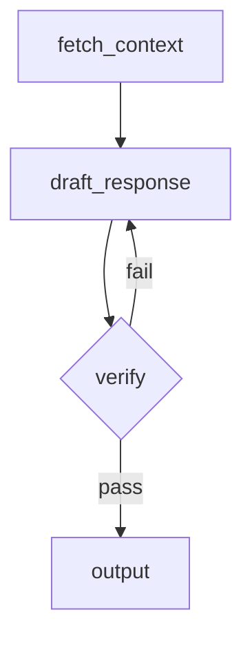

# agentme-edr-policy-021: AI workflow development standards

## Context and Problem Statement

AI workflow projects vary widely in how they structure directed graphs, manage state, evaluate outputs, and test execution paths. Without a shared baseline, projects accumulate incompatible patterns for flow design, state management, and dataset-driven testing.

Which tools, frameworks, and design patterns should AI workflow projects follow to ensure reproducibility, testability, and maintainability?

## Decision Outcome

**Use Python with LangGraph for flow orchestration and MLflow for experiment tracking and local evaluation.**

### Details

#### 01-language-and-framework

Workflows MUST be built with **LangGraph**. Use LangGraph `StateGraph` to model each distinct workflow as an explicit directed graph with typed state.

For all direct LLM calls within workflow nodes, use LangChain per [agentme-edr-018](018-ai-llm-development-standards.md). For agent nodes with tool-invocation loops, use deepagents per [agentme-edr-019](019-ai-agents-development-standards.md).

#### 03-observability-and-experiment-tracking

Use **MLflow** for all workflow observability and evaluation:

- **Workflow-level tracking:** Wrap each workflow run with `mlflow.start_run()` to capture traces, parameters, and metrics locally.
- **LLM-level auto-tracing:** Enable LangChain auto-tracing per [agentme-edr-018](018-ai-llm-development-standards.md) rule `03-llm-observability` by calling `mlflow.langchain.autolog()` during application startup. This captures inputs, outputs, token counts, and latency for every LangChain call within workflow nodes.
- Log run parameters (model name, temperature, prompt version) and output metrics (accuracy, latency, token counts) using `mlflow.log_param` / `mlflow.log_metric`.
- Run a local MLflow tracking server with `mlflow ui` to inspect runs during development. Do not require a remote MLflow server for local development.
- The project Makefile MUST expose a `dev-mlflow` target to start the local MLflow tracking server, per [agentme-edr-008](../devops/008-common-targets.md) rule `09-ai-project-dev-targets`.

#### 04-dataset-driven-accuracy-measurement

Eval dataset and implementation requirements are defined in [agentme-edr-028](028-ai-eval-standards.md). Testing requirements (when evals are required, release gates) are defined in [agentme-edr-007](../principles/007-project-quality-standards.md) rule `09-ai-project-testing-requirements`.

#### 05-flow-documentation

Each workflow MUST be documented as a **Mermaid graph** in a `README.md`. The diagram must match the LangGraph `StateGraph` definition:

- Use `graph TD` or `graph LR` direction.
- Label each node with its Python function name.
- Label conditional edges with the condition expression.
- Update the diagram whenever the graph topology changes.

Example minimal diagram block:



#### 06-verification-steps

Workflows MUST include at least one explicit verification node before producing final output:

- Model the verification step as a dedicated LangGraph node (e.g. `verify_output`).
- The node checks the draft output against defined acceptance criteria (schema validation, factual consistency check, rubric scoring, or LLM-as-judge call).
- On failure, the verification node MUST route back to the relevant generation node, not silently pass through.
- Log verification results (pass/fail, score, reason) as MLflow metrics on the current run.

#### 07-workflow-structure

Workflow logic MUST be organized as named workflows following [agentme-edr-026](026-pragmatic-hexagonal-architecture.md). Each workflow is an independent LangGraph `StateGraph` with a defined start node and end node, connecting LLM nodes, agent nodes, algorithmic nodes, states, routes, and decision nodes.

Workflows live inside `app/workflows/` (the application layer), while external integrations such as LLM providers, vector stores, and third-party APIs live under `adapters/connectors/` (the outbound adapter layer). Inbound interfaces (HTTP API, CLI) live under `adapters/` as inbound adapters.

For each workflow named `<workflow>`, the full project layout is:

```text
lib/src/<package_name>/
  adapters/
    http/                      # inbound: API server that triggers workflows
    cli/                       # inbound: CLI entry point (if applicable)
    connectors/                # outbound: external resource integrations
      openai/                  # LLM provider connector
      azure-openai/            # alternative LLM provider connector
      postgres/                # database connector (if applicable)
      vector-store/            # vector DB connector (if applicable)
  app/
    workflows/
      <workflow>/
        graph.py               # StateGraph definition; entry point for the workflow
        agents.py              # deepagents agent definitions used by this workflow
        states.py              # Typed state dataclasses / TypedDicts
        routes.py              # Conditional edge functions
  shared/                      # infrastructure-agnostic utilities
```

- `app/workflows/<workflow>/graph.py` MUST define and compile the `StateGraph` and expose a `graph` object that callers invoke.
- Tool calls within workflow nodes that interact with external systems MUST use connectors from `adapters/connectors/`, not inline API calls.
- Additional modules (prompts, schemas) MAY be added inside `app/workflows/<workflow>/` when they are specific to that workflow. Shared utilities belong in `shared/`.

#### 08-workflow-evals

Eval folder structure and script requirements are defined in [agentme-edr-028](028-ai-eval-standards.md).

#### 09-node-naming-conventions

LangGraph node names MUST follow a suffix convention that communicates the node's role at a glance. Names MUST be action-oriented and descriptive.

| Convention | Node type | When to use |
|---|---|---|
| suffix `_llm` | LLM call | Any node whose primary action is a direct LLM inference call (see [agentme-edr-018](018-ai-llm-development-standards.md)) |
| suffix `_step` | Algorithmic step | Deterministic logic with no LLM involvement (transformation, validation, routing) |
| suffix `_tool` | Tool/API call | A node that wraps a single external tool or API (e.g. a REST endpoint, DB query) |
| suffix `_agent` | Subgraph agent | A node that invokes a nested subgraph containing its own tool-invocation cycle and LLM calls; use the **deepagents** library for these nodes (see [agentme-edr-019](019-ai-agents-development-standards.md)) |
| prefix `evaluate_` | Judge node | A node that evaluates the quality, correctness, completeness, or progress of prior outputs and returns a structured verdict; MUST follow rule `13-judge-node-output-format` |

The Python function implementing the node SHOULD share the same name as the node alias passed to `add_node`, so that graph definitions and stack traces remain unambiguous:

```python
def draft_doc_llm(state): ...
graph.add_node("draft_doc_llm", draft_doc_llm)

# Tool node — calls the Stripe API
def stripe_api_tool(state): ...
graph.add_node("stripe_api_tool", stripe_api_tool)

# Agent node — uses deepagents for tool-invocation loop
def code_reviewer_agent(state): ...
graph.add_node("code_reviewer_agent", code_reviewer_agent)
```

Names MUST NOT use generic labels such as `node1`, `process`, or `run`. Each name must clearly express what action the node performs.

Judge nodes use a **prefix** convention instead of a suffix: the name MUST start with `evaluate_` followed by the subject being judged (e.g. `evaluate_progress`, `evaluate_quality`, `evaluate_completeness`, `evaluate_relevance`). This makes judge nodes immediately distinguishable from all other node types at a glance.

#### 10-workflow-unit-testing

All LLM calls within workflow nodes are external API calls and MUST be mocked in unit tests per [agentme-edr-018](018-ai-llm-development-standards.md) rule `04-unit-test-mocking`. Workflow unit tests must run fully offline with no real LLM provider calls.

Choose the mock utility based on what the node under test expects from the model:

- Use **`FakeListChatModel`** when nodes only read `AIMessage.content` (e.g. a routing node that checks a text label).
- Use **`GenericFakeChatModel`** when any node in the workflow expects tool calls, structured outputs, or when the workflow contains `_agent` nodes that drive a tool-invocation loop.

**Example — workflow with plain-text LLM nodes:**

```python
from langchain_core.language_models.fake_chat_models import FakeListChatModel

def test_document_workflow_approve_path():
    # Responses consumed in node execution order
    fake_model = FakeListChatModel(responses=["APPROVE", "Meets all criteria."])

    workflow = DocumentWorkflow(model=fake_model)
    result = workflow.run(input_doc)

    assert result.status == "approved"
```

**Example — workflow containing an agent node (`_agent` suffix):**

```python
from langchain_core.language_models.fake_chat_models import GenericFakeChatModel
from langchain_core.messages import AIMessage

def test_document_workflow_with_agent_node():
    tool_call_msg = AIMessage(
        content="",
        tool_calls=[{"name": "fetch_context", "args": {"doc_id": "42"}, "id": "c1"}]
    )
    agent_final_msg = AIMessage(content="Context retrieved successfully.")
    routing_msg = AIMessage(content="APPROVE")

    fake_model = GenericFakeChatModel(
        messages=iter([tool_call_msg, agent_final_msg, routing_msg])
    )

    workflow = DocumentWorkflow(model=fake_model)
    result = workflow.run(input_doc)

    assert result.status == "approved"
```

Workflows MUST accept the LLM instance as a constructor parameter so that unit tests can inject a fake. See the injectable LLM pattern in [agentme-edr-018](018-ai-llm-development-standards.md) rule `04-unit-test-mocking`.

#### 11-state-type-conventions

All TypedDict and dataclass types that represent LangGraph node or workflow state MUST end with `_state` in their name. This suffix signals at a glance that the type is a state boundary, not a plain data model.

**Naming reference:**

| Owner | Naming pattern | Example |
|---|---|---|
| Single agent / agent subgraph | `<agent_name>_agent_state` | `reviewer_agent_state` |
| Full workflow (`StateGraph`) | `<workflow_name>_workflow_state` | `document_workflow_state` |
| Named group of nodes sharing state | `<group_responsibility>_state` | `retrieval_pipeline_state` |

**Boundary rules:**

- Each agent or agent subgraph MUST define its own dedicated state type. Do not reuse or extend a generic state across unrelated agents.
- Each workflow (`StateGraph`) MUST define its own top-level state type. The workflow state is the authoritative boundary for that graph's inputs and outputs.
- When a group of nodes (not a full workflow and not a single agent) shares a state type, the type name MUST clearly reflect the shared responsibility. Generic names such as `shared_state`, `common_state`, or `global_state` are FORBIDDEN.
- Large workflows MUST NOT use a single monolithic state that all nodes read and write. Split the state into per-phase or per-agent state types scoped to the subgraph or set of nodes that produce or consume each field.

State type names SHOULD align with the agent or node names defined in rule `09-node-naming-conventions` (e.g., an agent node named `draft_doc_agent` has a state type named `draft_doc_agent_state`).

#### 12-workflow-naming-conventions

LangGraph `StateGraph` instances and their enclosing classes MUST be given a meaningful name that conveys the workflow's input, output, and/or behavior. The name MUST end with `Workflow` (PascalCase class) or `_workflow` (snake_case variable or directory).

Choose a name that summarises what the workflow consumes, processes, and produces — avoid generic labels such as `Pipeline`, `Flow`, `Graph`, or `Process`.

| Context | Pattern | Example |
|---|---|---|
| Python class | `<DescriptiveName>Workflow` | `FileMapJudgeReduceWorkflow` |
| Python variable / instance | `<descriptive_name>_workflow` | `file_map_judge_reduce_workflow` |
| Directory under `app/workflows/` | `<descriptive_name>_workflow` | `financial_report_analysis_workflow/` |

**Good names** communicate purpose at a glance:

- `FileMapJudgeReduceWorkflow` — maps files, judges each, then reduces results
- `FinancialReportAnalysisWorkflow` — analyses financial report inputs
- `MarketingCampaignExecutorWorkflow` — executes a marketing campaign end-to-end

**Bad names** (FORBIDDEN): `MainWorkflow`, `AgentGraph`, `ProcessFlow`, `Workflow1`, `RunGraph`.

#### 13-judge-node-output-format

Every node whose name starts with `evaluate_` (a judge node) MUST return a structured verdict object as its output. This ensures all judge nodes are interchangeable and their results can be uniformly consumed by downstream routing logic, logged, and compared across runs.

**Required output schema:**

```python
from typing import Literal, Optional
from dataclasses import dataclass, field

FindingLevel = Literal["OK", "INFO", "WARNING", "ERROR"]

@dataclass
class JudgeFinding:
    level: FindingLevel
    # MUST: short action-oriented label; < 10 words
    title: str
    # MUST when level != "OK": why this is an issue; < 30 words
    reason: Optional[str] = None
    # MUST when level != "OK": notes/findings using mandatory (MUST) or advisory (SHOULD) language; < 400 words
    details: Optional[str] = None
    # OPTIONAL: possible fixes, only when directly inferrable from the finding without further analysis; < 200 words
    fix: Optional[str] = None

@dataclass
class JudgeVerdict:
    # MUST: highest severity level across all findings; "OK" only when every finding is "OK"
    verdict: FindingLevel
    # MUST: at least one finding present
    findings: list[JudgeFinding] = field(default_factory=list)
```

Example (for logging, state storage, and inter-node communication):

```json
{
  "verdict": "WARNING",
  "findings": [
    {
      "level": "OK",
      "title": "All required sections present"
    },
    {
      "level": "WARNING",
      "title": "Code coverage below threshold",
      "reason": "Current coverage is 62%, minimum required is 80%.",
      "details": "The following modules have no test coverage: auth.py, payments.py. SHOULD add unit tests for all public methods in these modules.",
      "fix": "Add unit tests for auth.py and payments.py. Run `make test-coverage` to verify the threshold is met."
    }
  ]
}
```

**Routing from judge nodes:**

Downstream conditional edges MUST route on `verdict` only:

```python
def route_after_evaluate_quality(state) -> str:
    if state["evaluate_quality_result"].verdict in ("ERROR", "WARNING"):
        return "revise_draft_llm"
    return "publish_step"
```

**Logging:** Log `verdict` and the count of each level as MLflow metrics on the current run per rule `03-observability-and-experiment-tracking`.

#### 15-workflow-state-persistence

For long-running workflows that may need to be paused and resumed:

- Use LangGraph's built-in checkpointing with `MemorySaver` for development and testing.
- Use persistent checkpointers (e.g., `PostgresSaver`, or Redis-based checkpointers) for production workflows that need durability.
- Checkpoint state MUST be serializable (use TypedDict or dataclasses with JSON-compatible fields).
- Document the checkpoint strategy in the workflow's README.md.

**Example with MemorySaver (development):**

```python
from langgraph.checkpoint.memory import MemorySaver

checkpointer = MemorySaver()
graph = workflow.compile(checkpointer=checkpointer)

# Resume from checkpoint
result = graph.invoke(input_state, config={"thread_id": "session-123"})
```

**When to use checkpointing:**

- Workflows that take > 30 seconds to complete
- Workflows that require human-in-the-loop approval or input
- Workflows that are non-indempotent
- Workflows that may fail mid-execution and need to be retried from the last successful node
- Multi-session workflows where state persists across user interactions

## References

- [agentme-edr-018](018-ai-llm-development-standards.md) — LLM development standards: LangChain framework, provider configuration, LLM observability, and unit test mocking
- [agentme-edr-019](019-ai-agents-development-standards.md) — Agent development standards: deepagents framework, tool-invocation loops, and agent patterns
- [agentme-edr-026](026-pragmatic-hexagonal-architecture.md) — Adapter/application layer separation that defines the project layout
- [agentme-edr-014](014-python-project-tooling.md) — Python project tooling and structure
- [agentme-edr-024](024-ml-dataset-structure.md) — ML dataset structure for eval datasets
- [agentme-edr-028](028-ai-eval-standards.md) — AI eval standards: folder structure, script requirements, and MLflow tracking
- [agentme-edr-007](../principles/007-project-quality-standards.md) — Project quality standards including AI-tier testing requirements (rule `09-ai-project-testing-requirements`)
