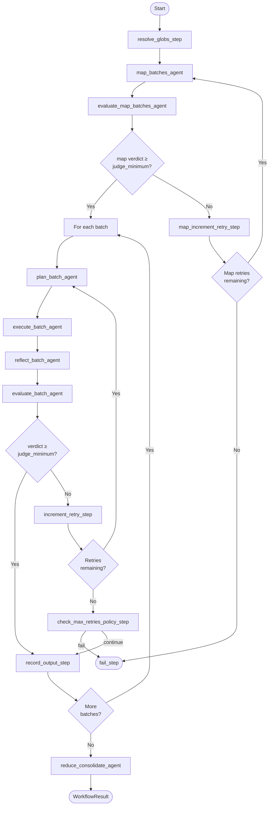

# deepworkflow

A graph of agents tailored to process a large number of files without compromising reasoning quality. The general workflow is **map → plan → execute → judge → reduce**.

Built on top of [deepagents](https://github.com/langchain-ai/deepagents) — a LangGraph-based ReAct agent framework with filesystem support. Exposed as a Python library (LangGraph subgraph embeddable in other applications) and as a standalone CLI with config file.

## Quick Start

### CLI

```bash
uvx deepworkflow --config mydeepworkflow.yml
```

### Library

```python
from deepworkflow import run_workflow, WorkflowConfig
from deepworkflow.shared.types import JudgeVerdict, OnMaxRetriesExceeded, WriteOption

config = WorkflowConfig(
    workspace_dir="/path/to/workspace",
    task_instructions="Review each file for security issues and report findings",
    task_files=["src/**/*.py"],
    task_files_write_option=WriteOption.READ_ONLY,
    judge_minimum=JudgeVerdict.WARNING,
    judge_max_retries=2,
    on_max_retries_exceeded=OnMaxRetriesExceeded.CONTINUE,
)

result = run_workflow(config)
print(result.output)        # Final consolidated output
print(result.thread_id)     # For checkpoint resume
print(result.status)        # "completed" or "failed"
```

## Workflow Diagram



## Workflow Phases

### Phase 1: Map

1. **resolve_globs_step** — Expand glob patterns in `task_files` into concrete file paths. Supports line-range suffixes (e.g. `file.py:10-50`). Fails if no files match.
2. **map_batches_agent** — Read-only ReAct agent that plans the batch strategy. Given the resolved files, task instructions, and batch_size constraint, it produces:
   - `task_overview` — high-level strategy description shared with all downstream agents
   - `consolidation_instructions` — instructions for the final reduce phase
   - `batches` — list of `BatchDefinition(batch_files, batch_instructions)` groupings
3. **evaluate_map_batches_agent** — Read-only judge that validates the map output (completeness, disjointness, instruction quality). If rejected, map_batches_agent retries with judge feedback.

### Phase 2: Execute (per batch)

For each batch produced by the map phase:

4. **plan_batch_agent** — Read-only agent that produces a detailed step-by-step execution plan given task_instructions + task_overview + batch_instructions + judge feedback (on retry).
5. **execute_batch_agent** — Agent with configurable write permissions that executes the plan. Stores its message history for reflect.
6. **reflect_batch_agent** — Continues the execute agent's conversation to self-report which files were read and written.
7. **evaluate_batch_agent** — Read-only judge that evaluates execution quality. If verdict < judge_minimum, the batch retries from plan_batch_agent with judge feedback.

### Phase 3: Reduce

8. **reduce_consolidate_agent** — Produces the final `workflow_output` by reviewing all batch outputs using `consolidation_instructions` from the map phase.

## Checkpointing & Resume

deepworkflow supports LangGraph checkpointing for crash recovery:

```bash
# Start with checkpointing enabled
deepworkflow --config mydeepworkflow.yml --checkpoint-dir ./checkpoints

# Resume a crashed run
deepworkflow --config mydeepworkflow.yml --checkpoint-dir ./checkpoints --thread-id <thread-id>
```

```python
result = run_workflow(config, checkpoint_dir="./checkpoints")
# On crash, resume:
result = run_workflow(config, thread_id=result.thread_id, checkpoint_dir="./checkpoints")
```

## Configuration

| Parameter | Required | Default | Description |
|-----------|----------|---------|-------------|
| `workspace_dir` | yes | — | Filesystem root for the agents |
| `task_instructions` | yes | — | Single string describing the task to perform |
| `task_files` | yes | — | List of file paths/globs to process (supports line ranges like `file.py:10-50`) |
| `task_files_write_option` | yes | — | `read-only`, `write-any`, or `write-only-task-files` |
| `task_files_batch_size` | no | all | Max files per batch (map agent decides grouping) |
| `judge_instructions` | no | standard | Custom evaluation criteria for the judge |
| `judge_minimum` | yes | — | Minimum quality: OK, INFO, WARNING, ERROR |
| `judge_max_retries` | yes | — | Max retries when judge rejects |
| `on_max_retries_exceeded` | yes | — | `fail` or `continue` |
| `max_failure_retries` | no | 0 | Retries on infrastructure failures |
| `model` | no | openai:gpt-4o | LLM model identifier |

Example `deepworkflow.yml`:

```yaml
workspace_dir: /path/to/workspace
task_instructions: "Review each file for security issues and report findings"
task_files:
  - "src/**/*.py"
  - "lib/**/*.py"
task_files_write_option: read-only
judge_minimum: WARNING
judge_max_retries: 2
on_max_retries_exceeded: continue
model: openai:gpt-4o
```

## Library Usage (Advanced)

### Embedding as a subgraph

```python
from deepworkflow import build_file_batch_workflow
from langgraph.checkpoint.sqlite import SqliteSaver

# Build with custom checkpointer
checkpointer = SqliteSaver.from_conn_string("checkpoints.db")
graph = build_file_batch_workflow(checkpointer=checkpointer)

# Invoke directly
result = graph.invoke(
    {"config": config},
    config={"configurable": {"thread_id": "my-thread"}},
)
```

## Development

```bash
make setup    # Install tools and dependencies
make build    # Build wheel
make lint     # Ruff + ty + pip-audit
make test     # Unit tests + examples
make eval     # Run evaluation suite (requires API key)
```

