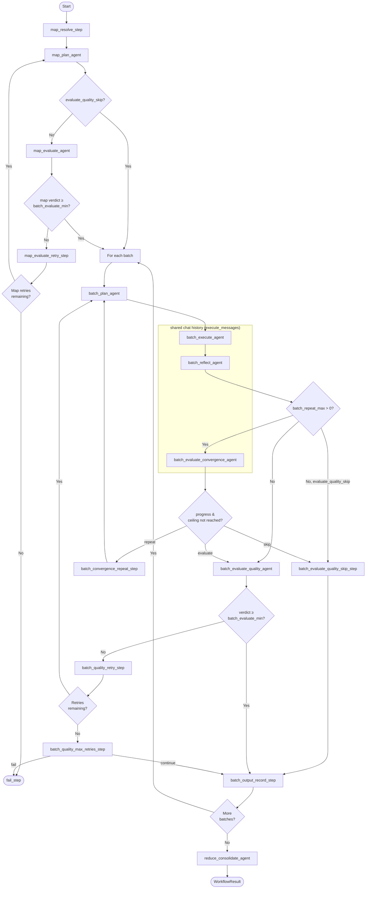

# deepworkflow

When running LLM tasks, single prompt shots are limited by how well the model organises itself internally into steps or TODO lists. If your task is too complex, too deep, or involves too many files at once, the model may lose parts of its reasoning — focusing on some aspects while "forgetting" others. This is expected behaviour; models are also deliberately conservative to avoid being too aggressive on every pass.

deepworkflow solves this by running your prompt through a **configurable quality pipeline** without requiring changes to the prompt itself. The core trade-off is **QUALITY ↔ COST**:

- **Less effort** → fewer judge checks, less parallelism, fewer LLM calls → faster and cheaper runs.
- **More effort** → more intermediate checks, more convergence loops → highest possible quality at higher cost.

## Getting Started

### CLI

Example `deepworkflow.yml`:

```yaml
workspace_dir: /path/to/workspace
workspace_write_option: write-any
task_instructions: "Evaluate if files in input/* are compliant with all rules in rules/* and generate one report per file in reports/"
task_files:
  - "input/**"
model:
  model_name: gpt-4o
  model_provider: openai
effort:
  level: 1
```

```bash
uvx deepworkflow --config deepworkflow.yml
```

## Usage

Depending on the effort level, different nodes are activated inside the workflow to verify quality at each stage. In practice this means you can:

1. Run a task at **minimum effort** to quickly verify that your prompt is well-formed and produces sensible output — fast and cheap.

2. Once the prompt is good enough, re-run at a higher effort level to ensure all edge cases are covered and quality is as high as possible — even across hundreds or thousands of files.

### Example

Context:
- Folder with 1000 files to be processed in `input/`
- Complex rule set to be taken care in folder `rules/`
- Prompt: "Evaluate if files in `input/*` are compliant with all rules in `rules/*` and generate one report per file in `reports/`"

While testing/improving your prompt:
- run deepworkflow with effort level=0; files=input/test.md
- check results
- this will be fast, but only for one file, and the quality is not guaranteed

After testing:
- run deepworkflow with effort level=5; files=input/**; batches=100
- 10 separate LLM contexts will run for 10 files each so it has more focus on the task; a quality judge agent will evaluate if the task was performed correctly and loop if not
- this might take a long time, but the quality will be guaranteed

The repetition and check patterns ensure that even cheaper models follow your prompt with the correct depth across all files without getting "lazy", all without having to rebuild a full custom workflow every time you need to raise or lower quality.

## How it works

A graph of agents tailored to process a large number of files without compromising reasoning quality. The general workflow is **map → plan → execute → reflect → [repeat loop] → evaluate quality → reduce**.

The repeat loop re-runs `plan → execute → reflect` while a **batch_evaluate_convergence_agent** detects meaningful work was done in the previous pass, up to a configurable ceiling (`batch_repeat_max`). Once all passes complete, a **batch_evaluate_quality_agent** performs the final quality check on the batch result.

Built on top of [deepagents](https://github.com/langchain-ai/deepagents) — a LangGraph-based ReAct agent framework with filesystem support. Exposed as a Python library (LangGraph subgraph embeddable in other applications) and as a standalone CLI with config file.


## Model Configuration

The `model` parameter is a **required factory function** `Callable[[str], BaseChatModel]`. It is called once per agent with the agent's name, allowing you to route different agents to different models:

```python
from langchain.chat_models import init_chat_model
from langchain_openai import ChatOpenAI

# Option 1: Same model for all agents
config = DeepWorkflowConfig(
    model=lambda _: ChatOpenAI(model="gpt-4o"),
    ...
)

# Option 2: Use init_chat_model (supports any provider)
config = DeepWorkflowConfig(
    model=lambda _: init_chat_model("gpt-4o", model_provider="openai"),
    ...
)

# Option 3: Route by agent name
AGENT_MODELS = {
    "batch_evaluate_quality_agent": "gpt-4o-mini",
    "map_evaluate_agent": "gpt-4o-mini",
}

def model_factory(agent_name: str):
    model_id = AGENT_MODELS.get(agent_name, "gpt-4o")
    return init_chat_model(model_id, model_provider="openai")

config = DeepWorkflowConfig(model=model_factory, ...)
```

Agent names: `map_plan_agent`, `map_evaluate_agent`, `batch_plan_agent`, `batch_execute_agent`, `batch_reflect_agent`, `batch_evaluate_convergence_agent`, `batch_evaluate_quality_agent`, `reduce_consolidate_agent`.

## Workflow Diagram



## Workflow Phases

### Phase 1: Map

1. **map_resolve_step** — Expand glob patterns in `task_files` into concrete file paths. Supports line-range suffixes (e.g. `file.py:10-50`). Fails if no files match.
2. **map_plan_agent** — Read-only ReAct agent that plans the batch strategy. Given the resolved files, task instructions, and batch_size constraint, it produces:
   - `map_plan_overview` — high-level strategy description shared with all downstream agents
   - `reduce_instructions` — instructions for the final reduce phase
   - `batches` — list of `BatchDefinition(batch_files, batch_instructions)` groupings
3. **map_evaluate_agent** — Read-only evaluator that validates the map output (completeness, disjointness, instruction quality). If rejected, map_plan_agent retries with feedback.

### Phase 2: Execute (per batch)

For each batch produced by the map phase:

4. **batch_plan_agent** — Read-only agent that produces a detailed step-by-step execution plan given task_instructions + map_plan_overview + batch_instructions + quality feedback (on retry).
5. **batch_execute_agent** — Agent with configurable write permissions that executes the plan. Stores its message history (`execute_messages`) for the agents that follow.
6. **batch_reflect_agent** — Continues `batch_execute_agent`'s conversation thread (shares `execute_messages`) to self-report which files were read and written.
7. **batch_evaluate_convergence_agent** — Continues the same conversation thread (shares `execute_messages`) to assess whether meaningful progress was made during the current pass. When `batch_repeat_max > 0`, loops back to `batch_plan_agent` if progress was made and the repeat ceiling hasn't been reached; otherwise hands off to quality evaluation.
8. **batch_evaluate_quality_agent** — Read-only evaluator that evaluates the overall quality of batch execution results. If verdict < batch_evaluate_min, the batch retries from batch_plan_agent with quality feedback.

### Phase 3: Reduce

9. **reduce_consolidate_agent** — Produces the final `reduce_output` by reviewing all batch outputs using `reduce_instructions` from the map phase.

## Checkpointing & Resume

deepworkflow supports LangGraph checkpointing for crash recovery:

```bash
# Start with checkpointing enabled
deepworkflow --config mydeepworkflow.yml --checkpoint-dir ./checkpoints

# Resume a crashed run
deepworkflow --config mydeepworkflow.yml --checkpoint-dir ./checkpoints --thread-id <thread-id>
```

```python
result = run_workflow(config, checkpoint_dir="./checkpoints")
# On crash, resume:
result = run_workflow(config, thread_id=result.thread_id, checkpoint_dir="./checkpoints")
```

## Configuration

| Parameter | Required | Default | Description |
|-----------|----------|---------|-------------|
| `workspace_dir` | yes | — | Filesystem root for the agents |
| `task_instructions` | yes | — | String describing the task to perform |
| `model` | yes | — | Factory `Callable[[str], BaseChatModel]`; called with agent name |
| `workspace_write_option` | no | `read-only` | `read-only`, `write-any`, or `write-only-task-files` |
| `effort` | no | level 3 preset | Effort controls (see Full YAML Reference below) |
| `effort.level` | no | 3 | Preset 1–10; detail fields can be added alongside |
| `effort.type` | no | `static` | `static` (use level+fields) or `auto` (agent-derived) |
| `effort.batch_evaluate_min` | no | `WARNING` | Min verdict to accept: `OK`, `INFO`, `WARNING`, `ERROR` |
| `effort.batch_evaluate_on_max_retries` | no | `continue` | Behavior on exhausted retries: `fail` or `continue` |
| `effort.batch_evaluate_quality_instructions` | no | standard | Custom quality criteria for the batch quality agent |
| `task_files` | no | None | File paths/globs to process (supports line ranges). Omit to let agent discover files |
| `task_files_exclude` | no | None | Glob patterns for files to always exclude from batches |
| `max_failure_retries` | no | 0 | Retries on infrastructure failures |
| `log_level` | no | `info` | Console verbosity: `none`, `info`, `debug` (full LLM output), `trace` (raw MLflow spans) |

Example `deepworkflow.yml`:

```yaml
workspace_dir: /path/to/workspace
task_instructions: "Review each file for security issues and report findings"
# model must be a dict of init_chat_model() kwargs
model:
  model_name: gpt-4o
  model_provider: openai
workspace_write_option: read-only
effort:
  level: 5                             # level 5 preset
  batch_evaluate_min: WARNING          # quality fields can be added alongside level
  batch_evaluate_on_max_retries: continue
# task_files:  # Omit to let the agent discover files
#   - "src/**/*.py"
```

## Library Usage (Advanced)

### Embedding as a subgraph

```python
from deepworkflow import build_file_batch_workflow
from langgraph.checkpoint.sqlite import SqliteSaver

# Build with custom checkpointer
checkpointer = SqliteSaver.from_conn_string("checkpoints.db")
graph = build_file_batch_workflow(checkpointer=checkpointer)

# Invoke directly
result = graph.invoke(
    {"config": config},
    config={"configurable": {"thread_id": "my-thread"}},
)
```

## Development

### Repository layout

| Directory | Contents |
|-----------|----------|
| `lib/` | Published Python library (`deepworkflow` package) |
| `examples/` | Runnable consumer examples (`basic-cli/`, `basic-lib/`) |
| `evals/` | Eval test suites (`eval-simple/`, `eval-complex/`) — require a live API key |

### Commands

```bash
make setup    # Install tools and dependencies
make build    # Build wheel
make lint     # Ruff + ty + pip-audit
make test     # Unit tests + examples
make eval     # Run evaluation suite (requires API key)
```

## Full YAML Configuration Reference

All available options for `deepworkflow.yml`:

```yaml
# ---------------------------------------------------------------------------
# Required
# ---------------------------------------------------------------------------

# Filesystem root that all agents can read/write (must be an absolute path)
workspace_dir: /path/to/workspace

# Natural-language description of the task to perform across all files
task_instructions: "Your task description here"

# Model configuration — passed to LangChain's init_chat_model()
# API keys are read from environment variables (OPENAI_API_KEY, ANTHROPIC_API_KEY, etc.)
# unless api_key is set here explicitly.
model:
  model_name: gpt-4o          # required; maps to init_chat_model's 'model' param
  model_provider: openai      # required; e.g. openai, anthropic, google-genai, azure_openai
  # api_key: sk-...           # optional; overrides env-var API key

# ---------------------------------------------------------------------------
# File selection
# ---------------------------------------------------------------------------

# Files or glob patterns to process. Supports line-range suffixes (file.py:10-50).
# Omit entirely to let map_plan_agent discover files from the workspace.
task_files:
  - "src/**/*.py"
  - "docs/*.md"
  - "README.md:1-50"          # optional line range

# Glob patterns for files that must always be excluded from processing batches.
# Applied after task_files glob expansion.
task_files_exclude:
  - "src/**/__pycache__/**"
  - "dist/**"

# ---------------------------------------------------------------------------
# Write permissions
# ---------------------------------------------------------------------------

# read-only              — agents cannot write any file (default)
# write-any              — agents can write any file in workspace_dir
# write-only-task-files  — agents can only write files listed in task_files
workspace_write_option: read-only

# ---------------------------------------------------------------------------
# Effort
# ---------------------------------------------------------------------------

# Effort controls. Use level: N (1–10) as a shorthand for a preset, or specify
# every field individually for fine-grained control.
# type: static (default) — use level + optional detail fields below
# type: auto             — a map_effort_analyze_agent derives the config automatically;
#                          no other fields may be set alongside type: auto
#   level 1 = single-batch, all evaluations skipped (fastest/cheapest)
#   level 3 = default when effort is omitted
#   level 10 = maximum evaluations and retries (highest quality, most expensive)
effort:
  level: 3
  type: static

  # agent  — use an LLM to split files into batches (recommended for complex tasks)
  # static — split files deterministically by max_files_per_batch
  map_plan_mode: agent

  # Maximum number of batches (null = no limit)
  max_batches: null

  # Maximum files per batch.
  # Required when map_plan_mode=static (unless max_batches=1).
  max_files_per_batch: 10

  # Max retries for the map evaluation loop. 0 = skip LLM map evaluation.
  map_evaluate_max_retries: 2

  # When true, skip batch_plan_agent and inject planning instructions directly
  # into batch_execute_agent (faster, less thorough).
  batch_skip_plan: false

  # Max extra plan→execute→reflect passes per batch (0 = disabled).
  batch_evaluate_convergence_max_retries: 1

  # Max retries for the per-batch quality evaluation loop. 0 = skip quality evaluation.
  batch_evaluate_quality_max_retries: 2

  # agent  — use an LLM agent for final result consolidation (recommended)
  # static — use a deterministic formatter
  reduce_mode: agent

  # Minimum quality verdict required to accept a batch result.
  # OK > INFO > WARNING > ERROR (higher = stricter)
  batch_evaluate_min: WARNING

  # Behaviour when max retries are exhausted without reaching batch_evaluate_min:
  #   fail     — abort the workflow with an error
  #   continue — record the best result and move on (default)
  batch_evaluate_on_max_retries: continue

  # Custom quality criteria for batch_evaluate_quality_agent.
  # Use MUST/REQUIRED/MANDATORY for ERROR findings, SHOULD/COULD for WARNING/INFO.
  # Omit to use the default quality check.
  batch_evaluate_quality_instructions: null

# ---------------------------------------------------------------------------
# Reliability & observability
# ---------------------------------------------------------------------------

# How many times to retry the whole workflow on infrastructure failures
# (e.g. network errors, authentication timeouts). Default: 0.
max_failure_retries: 0

# MLflow tracking URI for experiment logging.
# Default: sqlite:///mlflow.db (local file next to the working directory).
# Use a remote URI for shared tracking servers.
mlflow_tracking_uri: sqlite:///mlflow.db

# Console log verbosity:
#   none  — no output
#   info  — agent headers, in/out summaries, elapsed time, and a summary block (default)
#   debug — like info, but prints full LLM-generated text without truncation
#   trace — every MLflow span printed as JSON (raw tracing)
log_level: info
```

