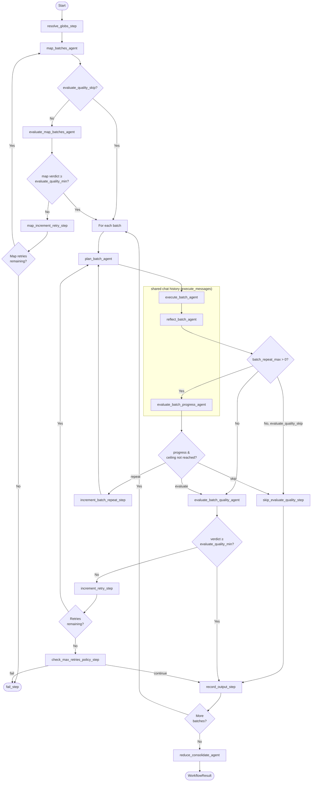

# deepworkflow

A graph of agents tailored to process a large number of files without compromising reasoning quality. The general workflow is **map → plan → execute → reflect → [repeat loop] → evaluate quality → reduce**.

The repeat loop re-runs `plan → execute → reflect` while a **evaluate_batch_progress_agent** (`evaluate_batch_progress_agent`) detects meaningful work was done in the previous pass, up to a configurable ceiling (`batch_repeat_max`). Once all passes complete, a **evaluate quality** (`evaluate_batch_quality_agent`) performs the final quality check on the batch result.

Built on top of [deepagents](https://github.com/langchain-ai/deepagents) — a LangGraph-based ReAct agent framework with filesystem support. Exposed as a Python library (LangGraph subgraph embeddable in other applications) and as a standalone CLI with config file.

## Getting Started

### CLI

```bash
uvx deepworkflow --config mydeepworkflow.yml
```

### Library

```python
from langchain_openai import ChatOpenAI

from deepworkflow import run_workflow, DeepWorkflowConfig
from deepworkflow.shared.types import EvaluateVerdict, OnMaxRetriesExceeded, WriteOption

# model is a factory: called with the agent name, returns a BaseChatModel
def model_factory(agent_name: str):
    return ChatOpenAI(model="gpt-4o")

config = DeepWorkflowConfig(
    workspace_dir="/path/to/workspace",
    task_instructions="Review each file for security issues and report findings",
    model=model_factory,
    workspace_write_option=WriteOption.READ_ONLY,
    evaluate_quality_min=EvaluateVerdict.WARNING,
    evaluate_quality_max_retries=2,
    evaluate_quality_on_max_retries=OnMaxRetriesExceeded.CONTINUE,
    # task_files=["src/**/*.py"],  # Omit to let the agent discover files
)

result = run_workflow(config)
print(result.output)        # Final consolidated output
print(result.thread_id)     # For checkpoint resume
print(result.status)        # "completed" or "failed"
```

## Model Configuration

The `model` parameter is a **required factory function** `Callable[[str], BaseChatModel]`. It is called once per agent with the agent's name, allowing you to route different agents to different models:

```python
from langchain.chat_models import init_chat_model
from langchain_openai import ChatOpenAI

# Option 1: Same model for all agents
config = DeepWorkflowConfig(
    model=lambda _: ChatOpenAI(model="gpt-4o"),
    ...
)

# Option 2: Use init_chat_model (supports any provider)
config = DeepWorkflowConfig(
    model=lambda _: init_chat_model("gpt-4o", model_provider="openai"),
    ...
)

# Option 3: Route by agent name
AGENT_MODELS = {
    "evaluate_batch_quality_agent": "gpt-4o-mini",
    "evaluate_map_batches_agent": "gpt-4o-mini",
}

def model_factory(agent_name: str):
    model_id = AGENT_MODELS.get(agent_name, "gpt-4o")
    return init_chat_model(model_id, model_provider="openai")

config = DeepWorkflowConfig(model=model_factory, ...)
```

Agent names: `map_batches_agent`, `evaluate_map_batches_agent`, `plan_batch_agent`, `execute_batch_agent`, `reflect_batch_agent`, `evaluate_batch_progress_agent`, `evaluate_batch_quality_agent`, `reduce_consolidate_agent`.

## Workflow Diagram



## Workflow Phases

### Phase 1: Map

1. **resolve_globs_step** — Expand glob patterns in `task_files` into concrete file paths. Supports line-range suffixes (e.g. `file.py:10-50`). Fails if no files match.
2. **map_batches_agent** — Read-only ReAct agent that plans the batch strategy. Given the resolved files, task instructions, and batch_size constraint, it produces:
   - `task_overview` — high-level strategy description shared with all downstream agents
   - `consolidation_instructions` — instructions for the final reduce phase
   - `batches` — list of `BatchDefinition(batch_files, batch_instructions)` groupings
3. **evaluate_map_batches_agent** — Read-only evaluator that validates the map output (completeness, disjointness, instruction quality). If rejected, map_batches_agent retries with evaluate_quality feedback.

### Phase 2: Execute (per batch)

For each batch produced by the map phase:

4. **plan_batch_agent** — Read-only agent that produces a detailed step-by-step execution plan given task_instructions + task_overview + batch_instructions + evaluate quality feedback (on retry).
5. **execute_batch_agent** — Agent with configurable write permissions that executes the plan. Stores its message history (`execute_messages`) for the agents that follow.
6. **reflect_batch_agent** — Continues `execute_batch_agent`'s conversation thread (shares `execute_messages`) to self-report which files were read and written.
7. **evaluate_batch_progress_agent** — *evaluate_batch_progress_agent.* Continues the same conversation thread (shares `execute_messages`) to assess whether meaningful progress was made during the current pass. When `batch_repeat_max > 0`, loops back to `plan_batch_agent` if progress was made and the repeat ceiling hasn't been reached; otherwise hands off to evaluate_quality.
8. **evaluate_batch_quality_agent** — *evaluate_batch_quality_agent.* Read-only evaluator that evaluates the overall quality of batch execution results. If verdict < evaluate_quality_minimum, the batch retries from plan_batch_agent with evaluate quality feedback.

### Phase 3: Reduce

9. **reduce_consolidate_agent** — Produces the final `workflow_output` by reviewing all batch outputs using `consolidation_instructions` from the map phase.

## Checkpointing & Resume

deepworkflow supports LangGraph checkpointing for crash recovery:

```bash
# Start with checkpointing enabled
deepworkflow --config mydeepworkflow.yml --checkpoint-dir ./checkpoints

# Resume a crashed run
deepworkflow --config mydeepworkflow.yml --checkpoint-dir ./checkpoints --thread-id <thread-id>
```

```python
result = run_workflow(config, checkpoint_dir="./checkpoints")
# On crash, resume:
result = run_workflow(config, thread_id=result.thread_id, checkpoint_dir="./checkpoints")
```

## Configuration

| Parameter | Required | Default | Description |
|-----------|----------|---------|-------------|
| `workspace_dir` | yes | — | Filesystem root for the agents |
| `task_instructions` | yes | — | String describing the task to perform |
| `model` | yes | — | Factory `Callable[[str], BaseChatModel]`; called with agent name |
| `workspace_write_option` | yes | — | `read-only`, `write-any`, or `write-only-task-files` |
| `evaluate_quality_max_retries` | yes | — | Max retries when evaluate_quality rejects |
| `evaluate_quality_on_max_retries` | yes | — | `fail` or `continue` |
| `task_files` | no | None | File paths/globs to process (supports line ranges). Omit to let agent discover files |
| `task_files_batch_size` | no | all | Max files per batch (map agent decides grouping) |
| `evaluate_quality_min` | no | WARNING | Minimum quality: OK, INFO, WARNING, ERROR |
| `evaluate_quality_batch_instructions` | no | standard | Custom evaluation criteria for evaluate_quality |
| `evaluate_quality_skip` | no | false | Skip all evaluate quality steps (useful for fast iteration) |
| `max_failure_retries` | no | 0 | Retries on infrastructure failures |
| `log_level` | no | none | Console verbosity: `none`, `info`, `debug` (full LLM output), `trace` (raw MLflow spans) |

Example `deepworkflow.yml`:

```yaml
workspace_dir: /path/to/workspace
task_instructions: "Review each file for security issues and report findings"
# model must be a dict of init_chat_model() kwargs
model:
  model: gpt-4o
  model_provider: openai
workspace_write_option: read-only
evaluate_quality_min: WARNING
evaluate_quality_max_retries: 2
evaluate_quality_on_max_retries: continue
# task_files:  # Omit to let the agent discover files
#   - "src/**/*.py"
```

## Library Usage (Advanced)

### Embedding as a subgraph

```python
from deepworkflow import build_file_batch_workflow
from langgraph.checkpoint.sqlite import SqliteSaver

# Build with custom checkpointer
checkpointer = SqliteSaver.from_conn_string("checkpoints.db")
graph = build_file_batch_workflow(checkpointer=checkpointer)

# Invoke directly
result = graph.invoke(
    {"config": config},
    config={"configurable": {"thread_id": "my-thread"}},
)
```

## Development

### Repository layout

| Directory | Contents |
|-----------|----------|
| `lib/` | Published Python library (`deepworkflow` package) |
| `examples/` | Runnable consumer examples (`basic-cli/`, `basic-lib/`) |
| `evals/` | Eval test suites (`file_batch_workflow/`) — require a live API key |

### Commands

```bash
make setup    # Install tools and dependencies
make build    # Build wheel
make lint     # Ruff + ty + pip-audit
make test     # Unit tests + examples
make eval     # Run evaluation suite (requires API key)
```

