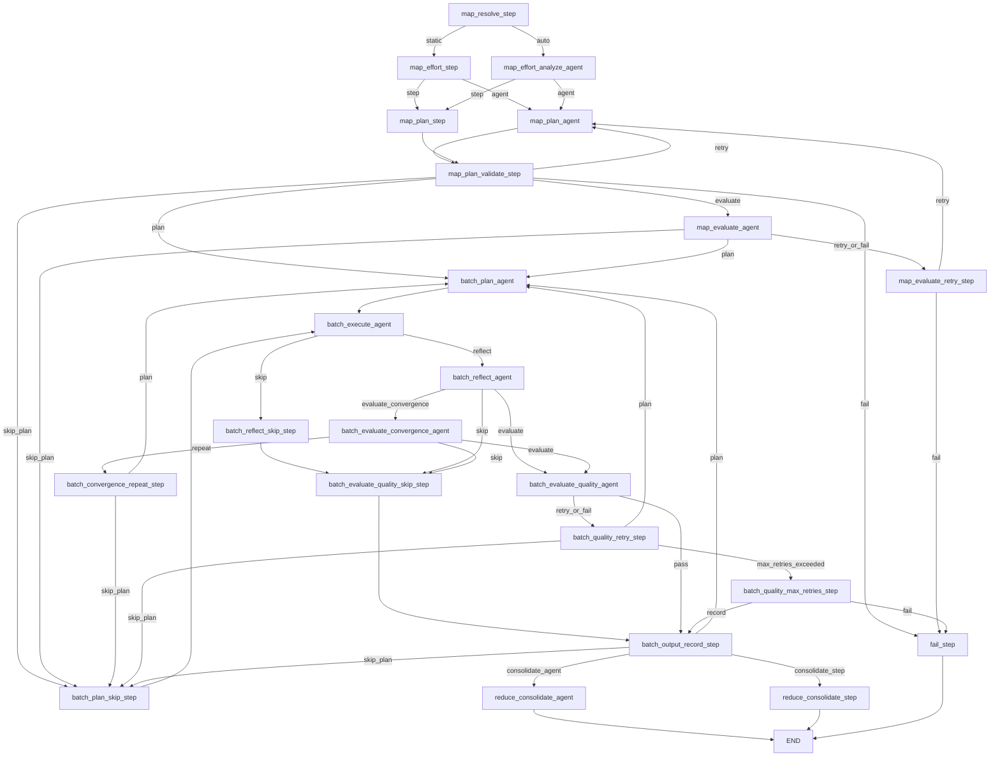

# file_batch_workflow

A LangGraph workflow that processes files in batches using a Map → Plan/Execute/Reflect/Evaluate → Reduce pattern.

## Graph

```mermaid
graph TD
    map_resolve_step --> |static| map_effort_step
    map_resolve_step --> |auto| map_effort_analyze_agent

    map_effort_step --> |agent| map_plan_agent
    map_effort_step --> |step| map_plan_step
    map_effort_analyze_agent --> |agent| map_plan_agent
    map_effort_analyze_agent --> |step| map_plan_step

    map_plan_agent --> map_plan_validate_step
    map_plan_step --> map_plan_validate_step

    map_plan_validate_step --> |fail| fail_step
    map_plan_validate_step --> |retry| map_plan_agent
    map_plan_validate_step --> |evaluate| map_evaluate_agent
    map_plan_validate_step --> |plan| batch_plan_agent
    map_plan_validate_step --> |skip_plan| batch_plan_skip_step

    map_evaluate_agent --> |plan| batch_plan_agent
    map_evaluate_agent --> |skip_plan| batch_plan_skip_step
    map_evaluate_agent --> |retry_or_fail| map_evaluate_retry_step

    map_evaluate_retry_step --> |retry| map_plan_agent
    map_evaluate_retry_step --> |fail| fail_step

    batch_plan_agent --> batch_execute_agent
    batch_plan_skip_step --> batch_execute_agent
    batch_execute_agent --> |reflect| batch_reflect_agent
    batch_execute_agent --> |skip| batch_reflect_skip_step

    batch_reflect_skip_step --> batch_evaluate_quality_skip_step

    batch_reflect_agent --> |evaluate_convergence| batch_evaluate_convergence_agent
    batch_reflect_agent --> |evaluate| batch_evaluate_quality_agent
    batch_reflect_agent --> |skip| batch_evaluate_quality_skip_step

    batch_evaluate_convergence_agent --> |repeat| batch_convergence_repeat_step
    batch_evaluate_convergence_agent --> |evaluate| batch_evaluate_quality_agent
    batch_evaluate_convergence_agent --> |skip| batch_evaluate_quality_skip_step

    batch_convergence_repeat_step --> |plan| batch_plan_agent
    batch_convergence_repeat_step --> |skip_plan| batch_plan_skip_step

    batch_evaluate_quality_skip_step --> batch_output_record_step

    batch_evaluate_quality_agent --> |pass| batch_output_record_step
    batch_evaluate_quality_agent --> |retry_or_fail| batch_quality_retry_step

    batch_quality_retry_step --> |plan| batch_plan_agent
    batch_quality_retry_step --> |skip_plan| batch_plan_skip_step
    batch_quality_retry_step --> |max_retries_exceeded| batch_quality_max_retries_step

    batch_quality_max_retries_step --> |fail| fail_step
    batch_quality_max_retries_step --> |record| batch_output_record_step

    batch_output_record_step --> |plan| batch_plan_agent
    batch_output_record_step --> |skip_plan| batch_plan_skip_step
    batch_output_record_step --> |consolidate_agent| reduce_consolidate_agent
    batch_output_record_step --> |consolidate_step| reduce_consolidate_step

    reduce_consolidate_agent --> END
    reduce_consolidate_step --> END
    fail_step --> END
```
